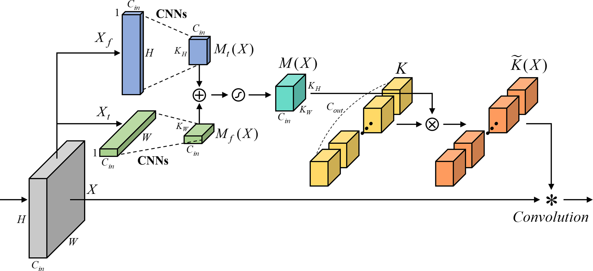

# ACNN for Text-Independent Speaker Recognition

Official implementation of **Adaptive Convolutional Neural Network for Text-Independent Speaker Recognition** 
by Seong-Hu Kim, Yong-Hwa Park @ Human Lab, Mechanical Engineering Department, KAIST

Accepted paper in [InterSpeech 2021](https://www.interspeech2021.org/)

Paper will be available.

## Adaptive Convolutional Neural Network Module
We use two scaling maps, which are frequency and time domain, to each axis for the adaptive kernel in the ACNN module.  The adaptive kernel is created by element-wise multiplication of each output channel $C_{out}$ of the content-invariant kernel $K$ with $M(X)$. The structure of proposed ACNN module for speaker recognition is shown as follows.

This module is applied to VGG-M and ResNet for text-independent speaker recognition. 

## Requirements and versions used
- pytorch >= 1.4.0
- pytorchaudio >= 0.4.0
- numpy >= 1.18

